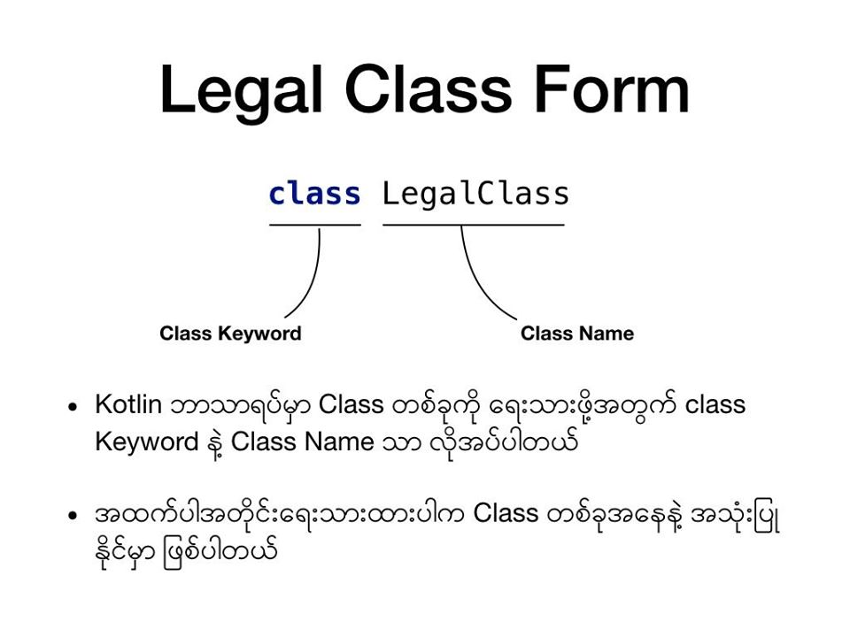
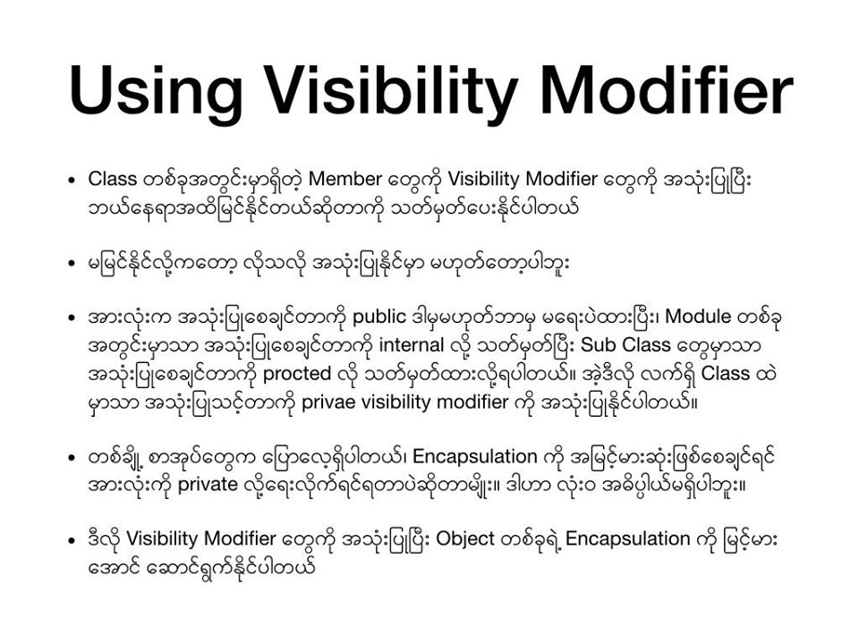
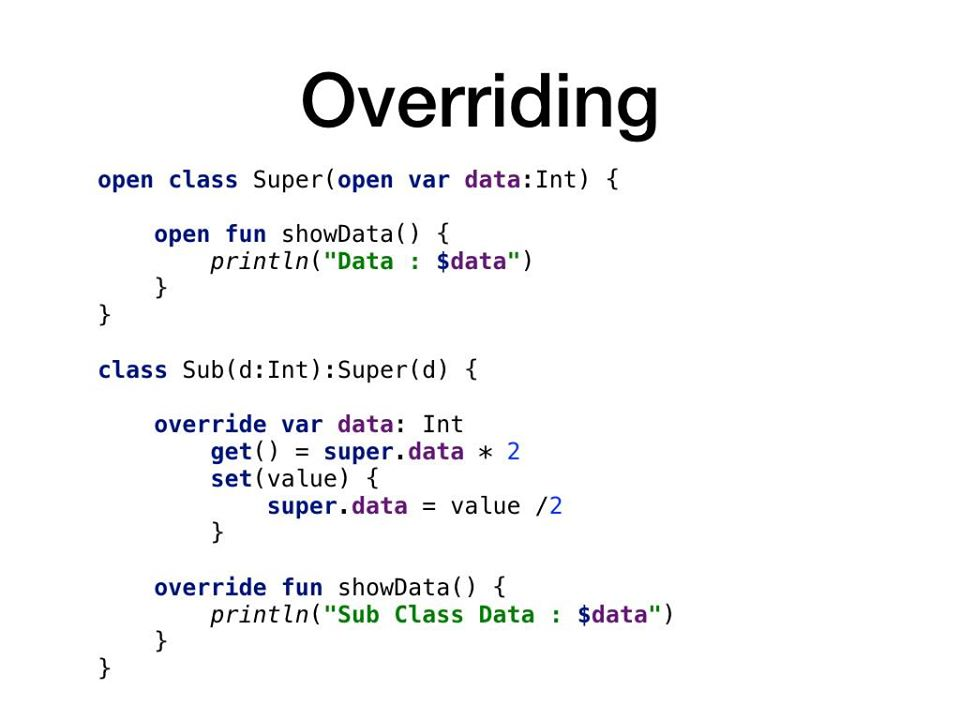
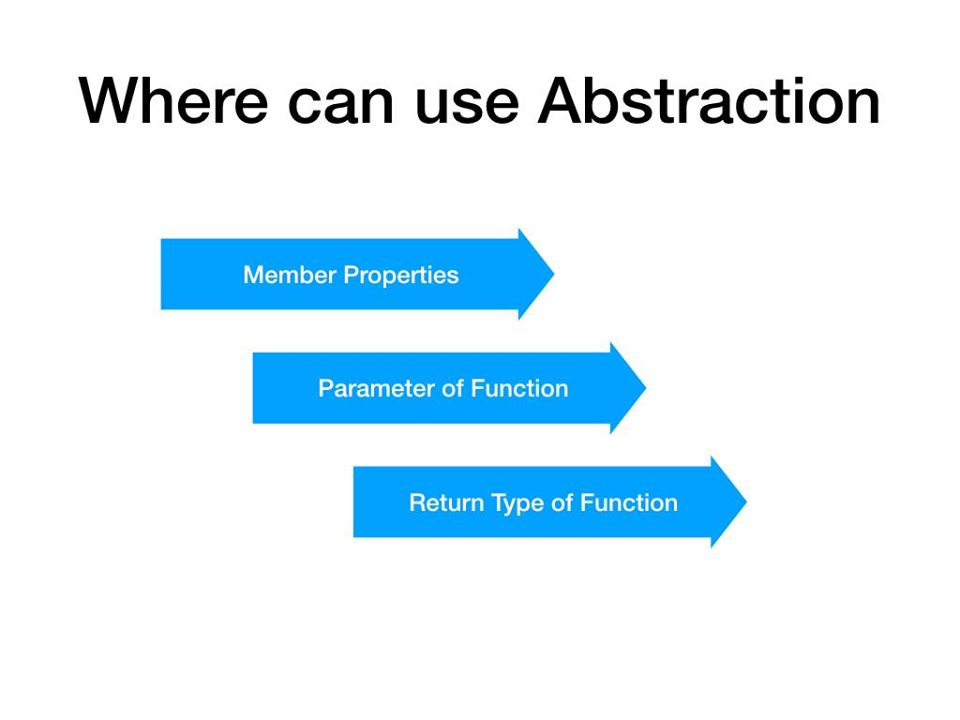

# Kotlin Myanmar Tutorials

## References

<a href="https://www.facebook.com/mr.piti/media_set?set=a.10216204660173387&type=3" target="_blank">https://www.facebook.com/mr.piti/media_set?set=a.10216204660173387&type=3</a>

<a href="https://www.facebook.com/mr.piti/media_set?set=a.10216250020627370&type=3" target="_blank">https://www.facebook.com/mr.piti/media_set?set=a.10216250020627370&type=3</a>